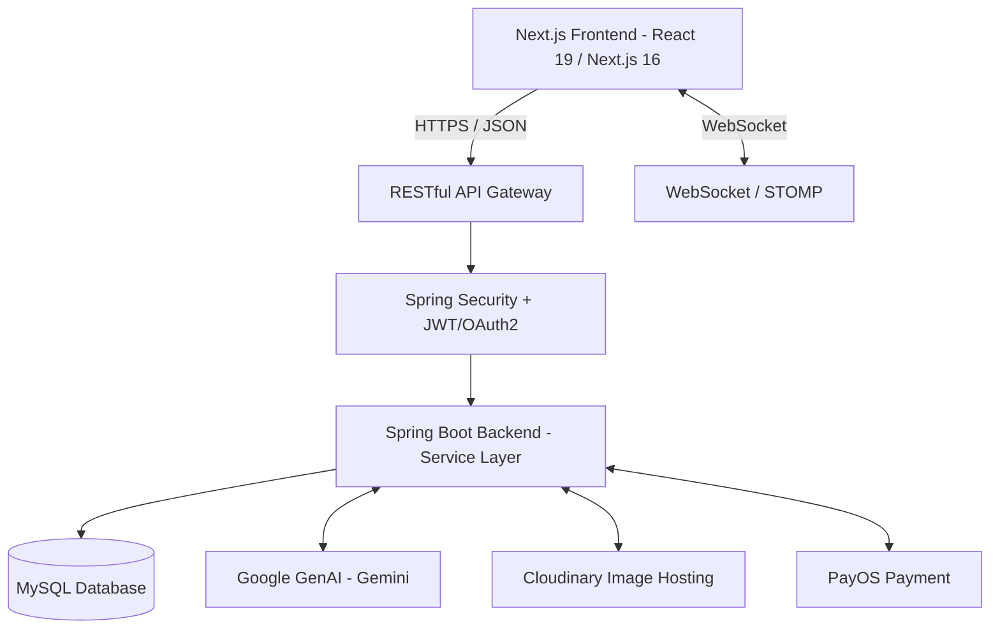

# Planora 🕊️
> **AI-Powered Wedding Planning Marketplace**
> *Nền tảng hỗ trợ lập kế hoạch đám cưới toàn diện và kết nối nhà cung cấp dịch vụ tiệc cưới tích hợp trí tuệ nhân tạo (AI).*

---

## 🌟 Giới thiệu Dự án
**Planora** là một hệ sinh thái cưới "All-in-one" được thiết kế nhằm đơn giản hóa toàn bộ hành trình chuẩn bị đám cưới của các cặp đôi. Thay vì phải tự tìm kiếm rời rạc trên mạng xã hội hay bảng tính thủ công, Planora cung cấp công cụ lập kế hoạch cưới cá nhân hóa tích hợp AI, giúp các cặp đôi tự động phân bổ ngân sách, gợi ý concept và kết nối trực tiếp với các nhà cung cấp dịch vụ cưới (Vendors) phù hợp nhất.

Dự án được phát triển dưới dạng bài tập lớn cho môn học **EXE101 – Experiential Entrepreneurship 1** tại **Đại học FPT**.

---

## 🚀 Tính Năng Cốt Lõi (Core Features)

### 1. Công cụ Lập Kế hoạch Cá nhân hóa (Wedding Plan Generator)
*   **Onboarding thông minh:** Người dùng nhập các dữ liệu đầu vào: ngân sách dự kiến, thời gian, địa điểm, số lượng khách mời, phong cách cưới mong muốn và mức độ ưu tiên cho từng hạng mục.
*   **Tạo kế hoạch tự động:** Hệ thống đề xuất concept cưới phù hợp, tự động tính toán phân bổ ngân sách tham khảo cho từng hạng mục dịch vụ (trang trí, váy cưới, chụp ảnh, makeup, tiệc cưới...) và thiết lập timeline/checklist công việc cụ thể theo từng giai đoạn chuẩn bị.

### 2. Sàn Giao dịch Dịch vụ Cưới (Vendor Marketplace & Matching)
*   **Khám phá & Tìm kiếm:** Nơi các vendor (Studio, Makeup Artist, Váy cưới, Decor, Planner...) đăng tải hồ sơ chuyên nghiệp, portfolio hình ảnh, bảng giá tham khảo và các gói dịch vụ.
*   **Gợi ý thông minh (Matching Engine):** Tự động kết nối các cặp đôi với vendor phù hợp nhất dựa trên vị trí địa lý, ngân sách khả dụng và phong cách mong muốn.
*   **So sánh & Shortlist:** Hỗ trợ lưu trữ danh sách các vendor tiềm năng và so sánh chi phí, đánh giá từ khách hàng trước khi đưa ra quyết định.

### 3. Quản lý Tiến trình (Interactive Dashboard)
*   **Checklist công việc:** Theo dõi và nhắc nhở các đầu việc cần chuẩn bị theo dòng thời gian từ lúc bắt đầu đến ngày cưới.
*   **Quản lý ngân sách (Budget Management):** Ghi nhận chi phí thực tế, so sánh với ngân sách dự kiến và cảnh báo khi có nguy cơ vượt ngân sách (Over-budget).
*   **Kênh trao đổi (Inquiry Flow):** Gửi yêu cầu tư vấn trực tiếp từ hệ thống đến các vendor và quản lý phản hồi, báo giá tập trung tại một nơi.

---

## 💻 Công Nghệ Sử Dụng (Technology Stack)

Hệ thống được phát triển theo mô hình **Client-Server** sử dụng kiến trúc **RESTful API** để tách biệt rõ ràng giữa Frontend và Backend.

### Frontend (`/planora-frontend`)
*   **Core:** React 19, Next.js 16 (App Router), TypeScript 5
*   **UI/UX/Styling:** Tailwind CSS v4, Lucide Icons (Thiết kế Responsive tối ưu cho mọi màn hình)
*   **Authentication:** Tích hợp Google OAuth (`@react-oauth/google`) để đăng nhập nhanh chóng
*   **State & Session Management:** Next.js Context API & Session Handler

### Backend (`/planora-backend`)
*   **Core Framework:** Spring Boot 3.5.x (Java 21)
*   **Security:** Spring Security, JWT (JSON Web Token), Google OAuth2 (Đăng nhập Google)
*   **Database & Migration:** MySQL 8.0, Flyway (Quản lý phiên bản cơ sở dữ liệu)
*   **Real-time & Communication:** Spring WebSocket, STOMP (Hỗ trợ thông báo realtime)
*   **AI Integration:** Spring AI + Google GenAI (Gemini API) (Xử lý gợi ý concept, checklist và ngân sách)
*   **Image Hosting:** Cloudinary
*   **Payment Gateway:** Tích hợp cổng thanh toán PayOS

---

## 🛠️ Kiến Trúc Hệ Thống (System Architecture)



---

## 📅 Lộ Trình Triển Khai (Roadmap)

*   **Phase 1: Core Foundation (Nền tảng)**
    *   Thiết lập cấu trúc dự án Spring Boot và Next.js.
    *   Thiết kế cơ sở dữ liệu MySQL và tích hợp Flyway.
    *   Xây dựng hệ thống đăng ký, đăng nhập (Authentication & Authorization) bằng JWT & Google OAuth.
    *   Tạo hồ sơ cá nhân cho người dùng và hồ sơ dịch vụ cho Vendor.
*   **Phase 2: Planning & Matching Core (Tính năng lõi)**
    *   Form nhập thông tin chuẩn bị cưới (Budget, Style, Location,...).
    *   Logic/Thuật toán phân bổ ngân sách dự kiến và gợi ý concept.
    *   API Matching Vendor và hiển thị kết quả kế hoạch cưới trên Dashboard.
*   **Phase 3: Marketplace & Inquiry Flow (Kết nối)**
    *   Trang danh sách Vendor, lọc và tìm kiếm theo danh mục dịch vụ, giá, khu vực.
    *   Xem chi tiết hồ sơ Vendor & Portfolio.
    *   Luồng gửi yêu cầu tư vấn (Inquiry) giữa cô dâu/chú rể và nhà cung cấp.
*   **Phase 4: Dashboard, Realtime & Payment Extension (Nâng cao)**
    *   Dashboard quản lý Checklist & Timeline tương tác.
    *   Thông báo realtime qua WebSocket khi có tin nhắn/inquiry mới.
    *   Tích hợp thanh toán đặt cọc qua cổng PayOS.

---

## 🌐 Triển Khai Hệ Thống (Deployment)

Hệ thống Planora đã cấu hình và tích hợp quy trình CI/CD & Deploy tự động trên môi trường Cloud:
*   **Database (MySQL):** Aiven.io (Gói Free)
*   **Storage (Image/Video):** Cloudinary (Gói Free)
*   **Backend (Spring Boot):** Railway (Tự động build và deploy qua GitHub)
*   **Frontend (Next.js):** Vercel (Tối ưu hóa SEO và tốc độ tải trang)

> [!IMPORTANT]
> Hướng dẫn thiết lập chi tiết tài khoản Cloud, biến môi trường, cấu hình CORS trên Spring Security đã được tổng hợp tại:
> 👉 **[Tài liệu hướng dẫn deploy dự án (docs/How_to_deploy.md)](file:///e:/Github/Planora/docs/How_to_deploy.md)**

---

## 🏁 Hướng Dẫn Cài Đặt & Chạy Thử Local (Setup & Run)

### Yêu cầu hệ thống
*   **Java 21 / JDK 21** trở lên (để chạy Spring Boot)
*   **Node.js v18** trở lên (để chạy Next.js Frontend)
*   **MySQL 8.0**

### 1. Khởi động Backend
1.  Di chuyển vào thư mục backend:
    ```bash
    cd planora-backend
    ```
2.  Cấu hình cơ sở dữ liệu MySQL và môi trường:
    * Sao chép hoặc tạo file [.environment](file:///e:/Github/Planora/planora-backend/.environment) cấu hình đầy đủ các biến kết nối MySQL, JWT Secret, và các client credentials.
3.  Chạy ứng dụng bằng Maven:
    ```bash
    ./mvnw spring-boot:run
    ```

### 2. Khởi động Frontend
1.  Di chuyển vào thư mục frontend:
    ```bash
    cd planora-frontend
    ```
2.  Cài đặt các gói phụ thuộc:
    ```bash
    npm install
    ```
3.  Thiết lập file cấu hình môi trường cục bộ:
    * Tạo file [.env.local](file:///e:/Github/Planora/planora-frontend/.env.local) chứa biến `NEXT_PUBLIC_API_URL` trỏ về API Backend của bạn (mặc định là `http://localhost:8080`) và `NEXT_PUBLIC_GOOGLE_CLIENT_ID`.
4.  Khởi động máy chủ dev ở chế độ local:
    ```bash
    npm run dev
    ```
5.  Mở trình duyệt truy cập: [http://localhost:3000](http://localhost:3000)

---

## 👥 Thành Viên Nhóm (Team Planora)

*   **Vũ Đức Giang** (DE190556) - *FullStack Developer*
*   **Phan Thanh Nguyên** (DE180215) - *FullStack Developer*
*   **Lê Văn Quân** (DS190663) - *Business Analyst*
*   **Nguyễn Thị Thuỳ Trâm** (DS190540) - *Business Analyst*
*   **Phan Thị Tuyết Ngân** (DE190738) - *UI/UX Designer*

*Giáo viên hướng dẫn:* **ThS. Nguyễn Thị Tú Sương**