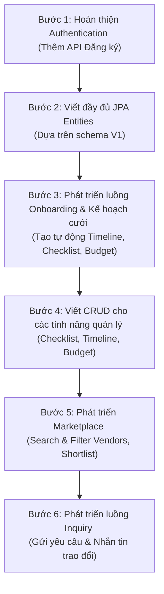

# Tài liệu Thiết kế API Backend - Planora MVP

Tài liệu này phân tích cấu trúc tính năng từ [Planora_MVP.md](file:///e:/Github/Planora/docs/Planora_MVP.md), đối chiếu với cấu trúc cơ sở dữ liệu hiện tại trong migration script [V1__init_schema.sql](file:///e:/Github/Planora/planora-backend/src/main/resources/db/migration/V1__init_schema.sql), để thiết kế chi tiết hệ thống RESTful API cho ứng dụng Planora. Đồng thời, tài liệu đề xuất lộ trình và hướng dẫn triển khai các bước tiếp theo.

---

## 1. Quy chuẩn Thiết kế API (RESTful Standards)

### 1.1. Base URL
Tất cả các API endpoints sẽ bắt đầu với tiền tố: `/api/v1` hoặc `/api` (hiện tại project đang sử dụng `/api`).

### 1.2. Định dạng Response chung (API Response Wrapper)
Để đảm bảo tính đồng nhất giữa frontend và backend, mọi API nên trả về một cấu trúc JSON chuẩn:

```json
{
  "status": 200,
  "message": "Thao tác thành công",
  "data": {},
  "timestamp": "2026-06-22T11:30:00"
}
```

*Trong trường hợp lỗi:*
```json
{
  "status": 400,
  "message": "Dữ liệu không hợp lệ",
  "errors": {
    "email": "Email không đúng định dạng",
    "password": "Mật khẩu phải chứa ít nhất 6 ký tự"
  },
  "timestamp": "2026-06-22T11:30:00"
}
```

### 1.3. Bảo mật (Authentication & Authorization)
*   Sử dụng **JWT (JSON Web Token)** đính kèm ở HTTP Header: `Authorization: Bearer <token>`.
*   Phân quyền dựa trên Role (ADMIN, VENDOR, USER) đã được cấu hình trong bảng `roles` và `users`.

---

## 2. Thiết kế API Chi tiết theo Modules MVP

### MODULE 1: AUTHENTICATION & USER PROFILE

#### 1. Đăng ký tài khoản (Register)
*   **Endpoint:** `POST /api/auth/register`
*   **Authentication:** Public (Cho phép truy cập tự do).
*   **Request Body (`RegisterRequest`):**
    ```json
    {
      "email": "customer@gmail.com",
      "password": "password123",
      "fullname": "Nguyễn Văn A",
      "phone": "0987654321",
      "role": "USER" // Hoặc "VENDOR"
    }
    ```
*   **Response (`LoginResponse`):** Trả về JWT token ngay khi đăng ký thành công để người dùng tự động đăng nhập.
    ```json
    {
      "token": "eyJhbGciOiJIUzI1NiIsIn...",
      "type": "Bearer"
    }
    ```

#### 2. Lấy thông tin cá nhân hiện tại
*   **Endpoint:** `GET /api/users/profile`
*   **Authentication:** Authenticated (Bắt buộc đăng nhập).
*   **Response:**
    ```json
    {
      "id": 3,
      "email": "customer@gmail.com",
      "fullname": "Nguyễn Văn A",
      "phone": "0987654321",
      "avatarUrl": "https://example.com/avatar.jpg",
      "role": "USER",
      "provider": "LOCAL",
      "status": "ACTIVE"
    }
    ```

#### 3. Cập nhật thông tin cá nhân
*   **Endpoint:** `PUT /api/users/profile`
*   **Authentication:** Authenticated.
*   **Request Body:**
    ```json
    {
      "fullname": "Nguyễn Văn B",
      "phone": "0909090909",
      "avatarUrl": "https://example.com/new-avatar.jpg",
      "address": {
        "city": "Hà Nội",
        "district": "Cầu Giấy",
        "ward": "Dịch Vọng",
        "detailAddress": "Số 123 Đường Cầu Giấy"
      }
    }
    ```
*   **Response:** Trả về thông tin user đã cập nhật.

---

### MODULE 2: WEDDING ONBOARDING & PLANNING (USP - Tạo kế hoạch tự động)

Module này giải quyết màn hình **4. Wedding Onboarding** (4 bước), **5. Loading**, và **6. Wedding Plan Result**.

#### 1. Gửi khảo sát Onboarding để tạo Kế hoạch cưới (Wedding Plan)
*   **Endpoint:** `POST /api/wedding-plans/onboarding`
*   **Authentication:** Authenticated (Role: `USER`).
*   **Request Body:**
    ```json
    {
      "title": "Đám cưới của Văn B & Hồng C",
      "weddingDate": "2026-12-25",
      "location": "Hà Nội",
      "guestCount": 200,
      "budget": 200000000.00,
      "styleIds": [2, 4], // Ví dụ: Minimalist (2), Garden Wedding (4)
      "priorityCategoryIds": [1, 2, 7] // Ví dụ: Studio (1), Makeup (2), Venue (7)
    }
    ```
*   **Mô tả Logic xử lý Backend:**
    1.  Tạo bản ghi trong bảng `wedding_plans` liên kết với `user_id`.
    2.  Lưu các phong cách lựa chọn vào bảng trung gian `wedding_plan_styles`.
    3.  Lưu dịch vụ ưu tiên vào bảng trung gian `wedding_plan_priorities`.
    4.  **Tự động phân bổ ngân sách:** backend dựa vào tổng `budget` tự động tạo ra các `budget_items` theo tỷ lệ mặc định (ví dụ: Venue 50%, Decor 15%, Photo 10%, Makeup 10%, Dress 10%, Khác 5%).
    5.  **Tự động tạo Checklist mặc định:** Backend tự động tạo các công việc trong bảng `checklist_tasks` dựa theo mốc thời gian cưới (ví dụ: "Đặt địa điểm tiệc cưới" trước 6 tháng, "Chọn váy cưới" trước 3 tháng, "Gửi thiệp mời" trước 1 tháng).
    6.  **Tự động tạo Timeline mặc định:** Tạo các mốc chính trong `timeline_events` tương ứng.
    7.  **Tạo gợi ý concept & matching:** Đưa ra concept gợi ý sơ bộ trong bảng `concept_suggestions` và quét qua cơ sở dữ liệu `vendors` để so khớp và gợi ý các vendor tương ứng trong bảng `vendor_matches` dựa trên style và budget.
*   **Response:** Trả về thông tin kế hoạch cưới vừa tạo cùng ID để Frontend redirect đến trang kết quả.

#### 2. Lấy Kế hoạch cưới đang hoạt động (Active Plan)
*   **Endpoint:** `GET /api/wedding-plans/active`
*   **Authentication:** Authenticated.
*   **Response:** Trả về thông tin tổng quan, danh sách concept gợi ý, và phân bổ ngân sách tóm tắt để render màn hình Dashboard và Kết quả kế hoạch cưới.

#### 3. Lấy danh sách Phong cách cưới (Wedding Styles)
*   **Endpoint:** `GET /api/wedding-styles`
*   **Authentication:** Public.
*   **Response:** Danh sách các style cưới có sẵn để user lựa chọn ở Bước 3 Onboarding (Traditional, Minimalist, Luxury, Garden, Beach...).

#### 4. Lấy danh sách Dịch vụ cưới (Service Categories)
*   **Endpoint:** `GET /api/service-categories`
*   **Authentication:** Public.
*   **Response:** Danh sách các danh mục dịch vụ (Studio, Makeup, Venue, Decor, Dress Rental...) phục vụ Bước 4 Onboarding.

---

### MODULE 3: CHECKLIST & TIMELINE MANAGEMENT

Phục vụ màn hình **16. Checklist Management** và **17. Timeline Page**.

#### 1. Lấy danh sách Checklist nhiệm vụ
*   **Endpoint:** `GET /api/wedding-plans/{planId}/checklist`
*   **Authentication:** Authenticated.
*   **Response:** Danh sách các `checklist_tasks` phân loại theo trạng thái (TODO, IN_PROGRESS, DONE) hoặc theo thứ tự hạn chót (`due_date`).

#### 2. Tạo công việc mới (Custom Task)
*   **Endpoint:** `POST /api/wedding-plans/{planId}/checklist`
*   **Authentication:** Authenticated.
*   **Request Body:**
    ```json
    {
      "title": "Mua nhẫn cưới",
      "description": "Mua tại cửa hàng PNJ Cầu Giấy",
      "dueDate": "2026-09-01",
      "priority": "HIGH"
    }
    ```

#### 3. Cập nhật trạng thái/thông tin công việc
*   **Endpoint:** `PUT /api/checklist-tasks/{taskId}`
*   **Authentication:** Authenticated.
*   **Request Body:** Cho phép cập nhật `title`, `description`, `dueDate`, `status` (TODO, IN_PROGRESS, DONE), hoặc `priority` (LOW, MEDIUM, HIGH).

#### 4. Xóa công việc
*   **Endpoint:** `DELETE /api/checklist-tasks/{taskId}`
*   **Authentication:** Authenticated.

#### 5. Lấy dòng thời gian đám cưới (Timeline)
*   **Endpoint:** `GET /api/wedding-plans/{planId}/timeline`
*   **Authentication:** Authenticated.
*   **Response:** Trả về các mốc sự kiện trong bảng `timeline_events` sắp xếp theo thời gian (`event_date`).

#### 6. Tạo/Sửa/Xóa sự kiện Timeline
*   `POST /api/wedding-plans/{planId}/timeline` - Thêm mốc thời gian.
*   `PUT /api/timeline-events/{eventId}` - Sửa thông tin mốc thời gian.
*   `DELETE /api/timeline-events/{eventId}` - Xóa mốc thời gian.

---

### MODULE 4: BUDGET MANAGEMENT

Phục vụ màn hình **15. Budget Management**.

#### 1. Lấy chi tiết ngân sách và phân bổ chi tiêu
*   **Endpoint:** `GET /api/wedding-plans/{planId}/budget`
*   **Authentication:** Authenticated.
*   **Response:** Trả về tổng ngân sách, số tiền ước tính, số tiền thực tế đã chi và danh sách breakdown các `budget_items` theo từng `budget_categories`.
    ```json
    {
      "totalBudget": 200000000.00,
      "totalEstimated": 195000000.00,
      "totalActualSpent": 65000000.00,
      "categories": [
        {
          "categoryId": 1,
          "categoryName": "Venue",
          "estimatedCost": 100000000.00,
          "actualCost": 50000000.00,
          "note": "Đã đặt cọc 50%"
        },
        ...
      ]
    }
    ```

#### 2. Cập nhật phân bổ/chi tiêu thực tế cho một hạng mục ngân sách
*   **Endpoint:** `PUT /api/budget-items/{itemId}`
*   **Authentication:** Authenticated.
*   **Request Body:**
    ```json
    {
      "estimatedCost": 100000000.00,
      "actualCost": 60000000.00,
      "note": "Đã thanh toán nốt phần còn lại"
    }
    ```

---

### MODULE 5: VENDOR MARKETPLACE & SHORTLIST

Phục vụ màn hình **8. Vendor Marketplace**, **9. Search & Filter**, **10. Vendor Detail**, **11. Compare**, và **12. Shortlist**.

#### 1. Danh sách nhà cung cấp (Lọc, tìm kiếm, phân trang)
*   **Endpoint:** `GET /api/vendors`
*   **Authentication:** Public.
*   **Query Parameters:**
    *   `query`: Tìm kiếm theo tên doanh nghiệp (`business_name`).
    *   `categoryId`: Lọc theo danh mục dịch vụ.
    *   `city`: Lọc theo thành phố hoạt động.
    *   `styleId`: Lọc theo phong cách cưới của vendor.
    *   `priceFrom`, `priceTo`: Khoảng giá tối thiểu & tối đa.
    *   `page`: Trang hiện tại (mặc định 0).
    *   `size`: Kích thước trang (mặc định 10).
*   **Response:** Trả về danh sách dạng phân trang (Pagination) cùng số lượng khớp để Frontend hiển thị số kết quả.

#### 2. Chi tiết nhà cung cấp
*   **Endpoint:** `GET /api/vendors/{id}`
*   **Authentication:** Public.
*   **Response:** Trả về profile chi tiết bao gồm thông tin liên hệ, portfolio (bảng `vendor_portfolios`), các gói dịch vụ (bảng `vendor_packages`), danh mục, đánh giá (`reviews`) trung bình.

#### 3. Danh sách vendor yêu thích (Shortlist) của cặp đôi
*   **Endpoint:** `GET /api/wedding-plans/{planId}/shortlist`
*   **Authentication:** Authenticated (Role: `USER`).
*   **Response:** Danh sách các vendor đã được lưu bởi cặp đôi.

#### 4. Thêm/Xóa vendor khỏi Shortlist
*   `POST /api/wedding-plans/{planId}/shortlist?vendorId={vendorId}` - Thêm vào shortlist.
*   `DELETE /api/wedding-plans/{planId}/shortlist/{vendorId}` - Xóa khỏi shortlist.

#### 5. Đề xuất Vendor thông minh (AI/Rule-based Matches)
*   **Endpoint:** `GET /api/wedding-plans/{planId}/matches`
*   **Authentication:** Authenticated.
*   **Response:** Danh sách các vendor đề xuất dựa trên điểm đánh giá phù hợp (`matching_score`) từ bảng `vendor_matches` cùng lý do phù hợp (`reason`).

---

### MODULE 6: INQUIRY (Gửi yêu cầu báo giá & Trao đổi)

Phục vụ các màn hình **13. Inquiry Form**, **14. Inquiry History**, **22. Inquiry Management (Vendor)**.

#### 1. Gửi yêu cầu mới cho Vendor
*   **Endpoint:** `POST /api/inquiries`
*   **Authentication:** Authenticated (Role: `USER`).
*   **Request Body:**
    ```json
    {
      "weddingPlanId": 1,
      "vendorId": 1,
      "title": "Yêu cầu báo giá chụp hình tiệc cưới ngoài trời",
      "message": "Xin chào, chúng tôi dự kiến tổ chức tiệc cưới ngoài trời vào ngày 25/12/2026 với 200 khách. Vui lòng gửi cho tôi báo giá chi tiết..."
    }
    ```

#### 2. Cặp đôi xem lịch sử yêu cầu đã gửi
*   **Endpoint:** `GET /api/inquiries/customer`
*   **Authentication:** Authenticated (Role: `USER`).
*   **Response:** Danh sách các yêu cầu có kèm trạng thái (`PENDING`, `RESPONDED`, `CLOSED`).

#### 3. Vendor xem danh sách yêu cầu nhận được
*   **Endpoint:** `GET /api/inquiries/vendor`
*   **Authentication:** Authenticated (Role: `VENDOR`).

#### 4. Lấy đoạn hội thoại (Messages) trong một yêu cầu cụ thể
*   **Endpoint:** `GET /api/inquiries/{inquiryId}/messages`
*   **Authentication:** Authenticated.
*   **Response:** Danh sách tin nhắn trao đổi qua lại giữa Vendor và Cặp đôi sắp xếp từ cũ đến mới.

#### 5. Gửi tin nhắn phản hồi trong yêu cầu
*   **Endpoint:** `POST /api/inquiries/{inquiryId}/messages`
*   **Authentication:** Authenticated.
*   **Request Body:**
    ```json
    {
      "message": "Chào bạn, gói dịch vụ của bên mình cho tiệc 200 khách có giá dao động từ 15-20 triệu..."
    }
    ```

---

## 3. Lộ trình phát triển & Các API nên làm tiếp theo (Next Steps)

Hiện tại, hệ thống đã cấu hình Security (JWT), có cơ sở dữ liệu hoàn chỉnh thông qua Flyway migration, nhưng các Entity JPA đang ở dạng rỗng (stub classes) và chưa có các Service/Controller khác ngoài Auth. 

Để phát triển backend tự tay bạn làm hiệu quả nhất, hãy đi theo trình tự logic dưới đây:



### BƯỚC 1: Hoàn thiện Authentication (Thêm API Đăng ký)
*   **Mục tiêu:** Cho phép người dùng đăng ký tài khoản cục bộ bằng Email & Mật khẩu thay vì chỉ có Google Login và Đăng nhập có sẵn.
*   **Việc cần làm:**
    1.  Cập nhật file `SecurityConfig.java` để cho phép truy cập public vào API đăng ký:
        ```java
        .requestMatchers("/api/auth/register").permitAll()
        ```
    2.  Tạo DTO `RegisterRequest.java` chứa các trường cần thiết.
    3.  Thêm phương thức `register(RegisterRequest request)` vào `AuthService` và triển khai trong `AuthServiceImpl`. Mã hóa mật khẩu bằng `PasswordEncoder.encode(...)` trước khi lưu vào database. Gán role mặc định dựa trên loại tài khoản mà người dùng chọn.

### BƯỚC 2: Khai báo đầy đủ thuộc tính cho JPA Entities
Trước khi viết API tiếp theo, bạn cần điền đầy đủ định nghĩa cho các stub classes trong thư mục `entity/` để khớp với cấu trúc DB của `V1__init_schema.sql`.

*Một ví dụ mẫu về khai báo thực thể `WeddingPlan` đầy đủ ánh xạ:*
```java
package com.fudn.planora.entity;

import com.fudn.planora.enums.EWeddingPlanStatus;
import jakarta.persistence.*;
import lombok.*;
import java.math.BigDecimal;
import java.time.LocalDate;
import java.time.LocalDateTime;
import java.util.Set;

@Entity
@Table(name = "wedding_plans")
@Getter @Setter @NoArgsConstructor @AllArgsConstructor @Builder
public class WeddingPlan {
    @Id
    @GeneratedValue(strategy = GenerationType.IDENTITY)
    private Long id;

    @ManyToOne(fetch = FetchType.LAZY)
    @JoinColumn(name = "user_id", nullable = false)
    private User user;

    private String title;
    
    @Column(name = "wedding_date")
    private LocalDate weddingDate;

    @Column(name = "guest_count")
    private Integer guestCount;

    private BigDecimal budget;
    private String location;

    @Enumerated(EnumType.STRING)
    private EWeddingPlanStatus status;

    @ManyToMany
    @JoinTable(
        name = "wedding_plan_styles",
        joinColumns = @JoinColumn(name = "wedding_plan_id"),
        inverseJoinColumns = @JoinColumn(name = "wedding_style_id")
    )
    private Set<WeddingStyle> weddingStyles;

    @ManyToMany
    @JoinTable(
        name = "wedding_plan_priorities",
        joinColumns = @JoinColumn(name = "wedding_plan_id"),
        inverseJoinColumns = @JoinColumn(name = "category_id")
    )
    private Set<ServiceCategorie> priorityCategories;

    @Column(name = "created_at", updatable = false)
    private LocalDateTime createdAt;
    
    @Column(name = "updated_at")
    private LocalDateTime updatedAt;

    @PrePersist
    protected void onCreate() {
        createdAt = LocalDateTime.now();
        updatedAt = LocalDateTime.now();
        if (status == null) status = EWeddingPlanStatus.DRAFT;
    }

    @PreUpdate
    protected void onUpdate() {
        updatedAt = LocalDateTime.now();
    }
}
```
*Làm tương tự cho các thực thể:* `WeddingStyle`, `ServiceCategorie`, `TimelineEvent`, `ChecklistTask`, `BudgetCategory`, `BudgetItem`.

### BƯỚC 3: Xây dựng API Onboarding & Thuật toán đề xuất kế hoạch (Core USP)
Đây là tính năng quan trọng nhất tạo sự khác biệt cho ứng dụng của bạn. Bạn nên triển khai một dịch vụ tạo kế hoạch cưới tự động (`PlanningService`):
1.  **Thiết kế API Endpoint:** `POST /api/wedding-plans/onboarding`.
2.  **Viết Service logic:**
    *   Tạo mới một `WeddingPlan`.
    *   **Logic Phân bổ Ngân sách:** Khi nhận được tổng ngân sách từ cặp đôi, hãy chạy một hàm tự động tạo các bản ghi `BudgetItem` dựa vào các `BudgetCategory` sẵn có trong database (Venue, Decoration, Photography, Makeup...) với tỷ lệ % ngân sách được cấu hình trước.
    *   **Logic Tạo Checklist Mẫu:** Khởi tạo danh sách các công việc (`ChecklistTask`) chuẩn như: "Lập ngân sách chi tiết" (Hạn chót: WeddingDate - 9 tháng), "Đặt địa điểm tiệc cưới" (WeddingDate - 6 tháng), "Thuê trang phục và thử váy" (WeddingDate - 2 tháng), v.v.
    *   **Logic So khớp Vendor ban đầu:** Đánh giá độ tương thích của các `Vendor` trong khu vực có trùng `WeddingStyle` và phù hợp với khoảng ngân sách của cặp đôi, tự động thêm vào `VendorMatches` kèm tỷ lệ trùng khớp (`matchingScore`).

### BƯỚC 4: Các API CRUD cho các công cụ lập kế hoạch
Khi đã có kế hoạch đám cưới được tạo ra sau bước Onboarding, người dùng sẽ bắt đầu tinh chỉnh. Bạn cần viết các API:
*   `GET /api/wedding-plans/active` để load trang Dashboard tổng quan.
*   Cụm API checklist: `GET` danh sách công việc, `PUT` để tích hoàn thành công việc (chuyển trạng thái từ `TODO` sang `DONE`).
*   Cụm API ngân sách: `GET` bảng ngân sách để theo dõi chi tiêu và `PUT` để cập nhật chi phí thực tế (`actualCost`) khi họ đã thanh toán đặt cọc cho một hạng mục nào đó.

---

## 4. Tổng kết
Để bắt đầu tự tay viết, bạn nên đi theo **Bước 1 (Đăng ký tài khoản)** và **Bước 2 (Khai báo JPA Entities cho các stub classes)** trước tiên. Việc này giúp ổn định dữ liệu và có đủ tài khoản để test các chức năng sau này. Sau đó tiến hành làm **Bước 3 (API Onboarding)** để hoàn thiện luồng đi cốt lõi của ứng dụng.
